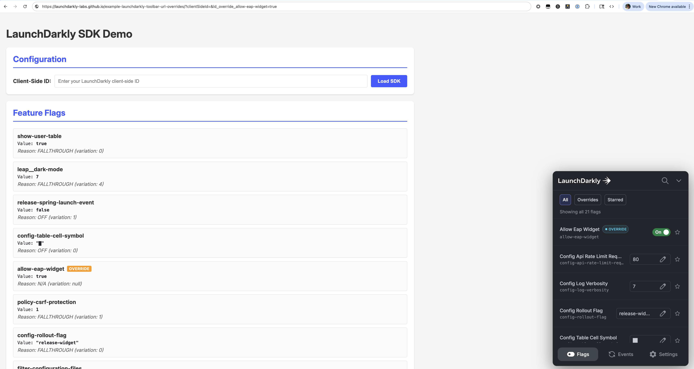

# LaunchDarkly Dev Toolbar with URL-Shareable Overrides

[](https://opensource.org/licenses/Apache-2.0)

A simple HTML5 application that provides a visual interface for viewing and managing LaunchDarkly feature flags with URL-shareable overrides.

> **LaunchDarkly Labs**: This repository is maintained by LaunchDarkly Labs. While we try to keep it up to date, it is not officially supported by LaunchDarkly. For officially supported SDKs and tools, visit [launchdarkly.com](https://launchdarkly.com).



## Features

### 🎯 Flag Visualization
- Real-time display of all feature flags
- Shows flag values, evaluation reasons, and variation indices
- Visual indicators for flags with active overrides
- Auto-updates when flags change

### 🔗 URL-Shareable Overrides
- Flag overrides automatically sync to URL parameters
- Share URLs with specific flag configurations
- Overrides persist across page reloads
- Load overrides directly from URL query parameters

### 🛠️ Interactive Dev Toolbar
- Built-in LaunchDarkly developer toolbar integration
- Override flag values locally without affecting other team members
- Test different flag variations instantly
- Event interception for debugging

### 📊 SDK Logging
- Custom logger displays all SDK events in real-time
- Color-coded log levels (debug, info, warn, error)
- Auto-scrolling log viewer
- Timestamps for all log entries

## Getting Started

### Prerequisites
- A LaunchDarkly account with a client-side ID
- A modern web browser with ES module support

### Usage

1. **Open the application**
   ```
   https://your-github-username.github.io/repo-name/
   ```

2. **Enter your LaunchDarkly Client-Side ID**
   - Paste your client-side ID in the configuration form
   - Click "Load SDK"
   - The SDK will initialize and display all your flags

3. **View and Override Flags**
   - All flags are displayed with their current values
   - Flags with overrides show an orange "OVERRIDE" badge
   - Use the toolbar to modify flag values

4. **Share Flag Configurations**
   - Override flags using the toolbar
   - Copy the URL from your address bar
   - Share with teammates - they'll see the same flag overrides

## URL Parameter Format

Overrides are stored in the URL with the format:
```
?clientSideId=YOUR_ID&ld_override_flagname=value
```

**Example:**
```
?clientSideId=abc123&ld_override_enable-feature=true&ld_override_max-items=10
```

Values are JSON-encoded, supporting:
- Booleans: `true`, `false`
- Numbers: `42`, `3.14`
- Strings: `"hello"`
- JSON objects: `{"key":"value"}`

## Architecture

### Files

- **`index.html`** - Main application UI and styles
- **`app.js`** - Core application logic, flag display, and SDK integration
- **`flag-url-override-plugin.js`** - Reusable plugin for URL-based override management

### Flag URL Override Plugin

The `flag-url-override-plugin.js` module provides a reusable wrapper around LaunchDarkly's `FlagOverridePlugin` that adds URL synchronization.

#### API

```javascript
import { createFlagUrlOverridePlugin } from './flag-url-override-plugin.js';

const plugin = createFlagUrlOverridePlugin({
  parameterPrefix: 'ld_override_',  // URL parameter prefix
  overrideOptions: {},              // Options for FlagOverridePlugin
  logger: console                   // Logger instance
});

// Register callback for override changes
plugin.onOverrideChange((flagKey, action) => {
  // Handle override changes
  // action: 'set', 'remove', or 'clear'
});

// Sync current overrides to URL
plugin.syncInitialOverrides();
```

## Development

### Local Development

1. **Clone the repository**
   ```bash
   git clone https://github.com/your-username/repo-name.git
   cd repo-name
   ```

2. **Start a local server**
   ```bash
   # Using Python
   python -m http.server 8080

   # Or using Node.js
   npx http-server -p 8080
   ```

3. **Open in browser**
   ```
   http://localhost:8080
   ```

### Deployment

The repository includes a GitHub Actions workflow that automatically deploys to GitHub Pages on every push to `main`.

#### Setup GitHub Pages

1. Go to **Settings → Pages**
2. Under "Build and deployment", select **Source: GitHub Actions**
3. Push to `main` branch to trigger deployment

The site will be available at:
```
https://your-username.github.io/repo-name/
```

## How It Works

### Initialization Flow

1. **URL Parameters Parsed**
   - Client-side ID extracted from `clientSideId` parameter
   - Flag overrides loaded from `ld_override_*` parameters

2. **SDK Initialization**
   - LaunchDarkly client initialized with custom logger
   - Flag override and event interception plugins registered
   - Plugins configured with URL sync capabilities

3. **Override Loading**
   - URL overrides automatically applied on initialization
   - Display updated to show override badges

4. **Real-time Sync**
   - Override changes immediately sync to URL
   - Flag display updates to show/hide badges
   - URL updates without page reload (using `replaceState`)

### Override Synchronization

The plugin monkey-patches three key methods:

- **`setOverride(flagKey, value)`** - Sets override, syncs to URL, updates display
- **`removeOverride(flagKey)`** - Removes override, syncs to URL, updates display
- **`clearAllOverrides()`** - Clears all overrides, syncs to URL, refreshes display

All changes are immediately reflected in:
1. The URL (via `history.replaceState`)
2. The flag display (badges appear/disappear)
3. The flag values (updates in real-time)

## Configuration

### Customizing the Parameter Prefix

Edit `app.js` to change the URL parameter prefix:

```javascript
const flagOverridePlugin = createFlagUrlOverridePlugin({
  parameterPrefix: 'myapp_flag_',  // Use custom prefix
  overrideOptions: {},
  logger: logger
});
```


## Troubleshooting

### SDK Not Initializing

- **Check client-side ID**: Ensure your client-side ID is correct
- **Check browser console**: Look for error messages
- **Verify SDK logs**: Check the logs panel for initialization errors

### Overrides Not Working

- **Check toolbar settings**: Ensure the toolbar isn't set to refresh on override changes
- **Verify plugin registration**: Check that both plugins are passed to the SDK
- **Check console logs**: Look for `[setOverride]` log messages

### URL Not Updating

- **Check browser compatibility**: Ensure your browser supports `history.replaceState`
- **Check console logs**: Look for `[syncOverridesToUrl]` messages
- **Verify no errors**: Check for JavaScript errors in console

## Resources

- [LaunchDarkly Documentation](https://docs.launchdarkly.com/)
- [Developer Toolbar Guide](https://launchdarkly.com/docs/home/getting-started/dev-toolbar)
- [Client-Side JavaScript SDK](https://docs.launchdarkly.com/sdk/client-side/javascript)

## License

This project is licensed under the Apache License 2.0 - see the [LICENSE](LICENSE) file for details.
